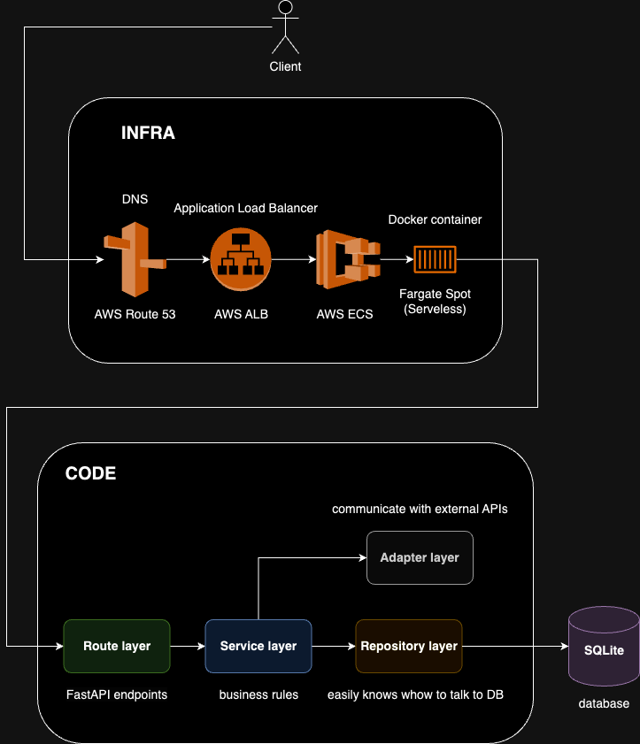

# City service 

Brazilian cities service. With that you can find any city in Brazil by name or state abbreviation.


# System Design



# Design Patterns (for scalability and maintainability)

- **Service Pattern**: note that all endppints rely on the service layer to implement the business rules
- **Repository Pattern**: in turn, the service layer rely on the repository layer on fetching the data from data sources
- **Adapter Pattern**: this project fetch city data from IBGE API, so an adapter layer was implemented. Also it's used by the service layer


# Tools worth mentioning


- **FastAPI**

This project uses FastAPI as its core.

- **SQLite**

Simple SQL database

- **SQLAlchemy**

CLassic ORM, but with asyncio

- **Alembic**

Manager of migrations in database

- **Pytest**

Fast testing library used asyncio (when necessary)

- **pip-tools**

Used for managing the dependencies up to date smoothly

- **invoke**

The tasks defined in tasks.py automate common actions within a Python project. They make use of the `invoke` library to execute shell commands. The script contains the following functions:


**requirements**: A task function to generate the **requirements.txt** file. 

**lint**: A task function to perform linting checks using **isort** and **black**.

**format**: A task function to format the code using **isort** and **black**.

**dkbuild**: A task function to build a Docker image named "city-service" for the FastAPI project.

**dkrun**: A task function to run a Docker container named "city-service" on port 8000.

*Obs.: All the previous commands can be executed by:*

```bash
inv <task_name>
```

# Testing

This project uses pytest + coverage for testing

```bash
source path/to/your/executable/python3.11.4-virtualenv
pytest --cov
```

# Running

- Local:

```bash
source path/to/your/executable/python3.11.4-virtualenv
pip install -r requirements.txt
uvicorn main:app
```

- Docker container

```bash
inv dkbuild
inv dkrun
```

*Obs.: dkrun command also creates a Docker network if you intend to run it alongside a Docker frontend*
